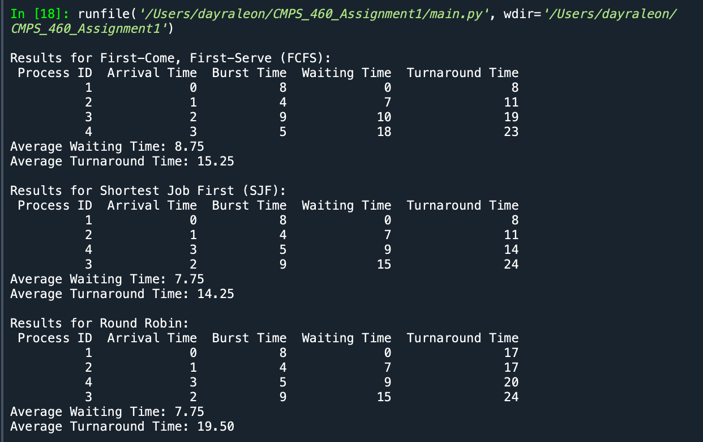

# CMPS_460_Assignment1 Process Scheduling Algorithms

## Overview
This application simulates various CPU scheduling algorithms, including First-Come, First-Serve (FCFS), Shortest Job First (SJF), Shortest Remaining Time (SRT), and Round Robin scheduling(RR). The intended audience includes computer science students, educators,and software developers interested in understanding and visualizing process scheduling in operating systems.

### Problem Statement
In modern computing environments, efficient process scheduling is crucial for optimizing CPU utilization and minimizing response time. This application helps users visualize and understand different scheduling algorithms, allowing them to compare performance metrics such as waiting time and turnaround time for various process sets.

## Features
- **First-Come, First-Serve (FCFS):** Executes processes in the order they arrive.
- **Shortest Job First (SJF):** Selects the process with the smallest burst time.
- **Shortest Remaining Time (SRT):** Preempts the currently running process if a new process arrives with a shorter burst time.
- **Round Robin(RR):** Allocates a fixed time quantum to each process, allowing for fair CPU sharing among processes.
- **User-friendly output:** Displays results in a clear tabular format, including waiting time and turnaround time for each process.
- **Average waiting and turnaround time calculations:** Provides overall performance metrics for the scheduling algorithms.

## How to Run the App
1. **Clone the repository:**
   ```bash
   git clone https://github.com/dayraleon/CMPS_460_Assignment1.git

## Output
The application will output the scheduling results for each algorithm in a tabular format. Below is an example output image:


